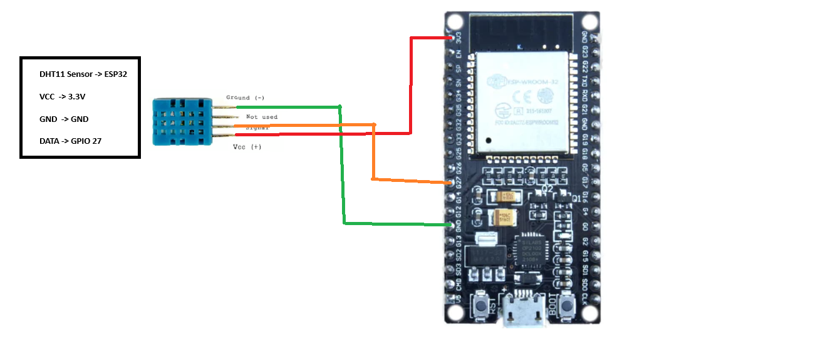
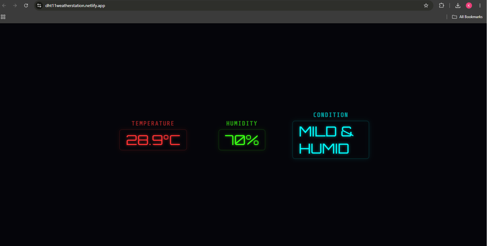

# ESP32 Smart Weather Monitoring System

An IoT-based real-time weather monitoring system built using ESP32, DHT11 sensor, Firebase Realtime Database, and a web dashboard.

The system collects temperature and humidity data, sends it wirelessly to the cloud, and displays live readings through a web interface.

---

## Features

- Real-time temperature monitoring
- Real-time humidity monitoring
- ESP32 WiFi communication
- Firebase Realtime Database integration
- Live web dashboard
- Remote monitoring through internet
- Responsive user interface

---

## Hardware Components

| Component | Purpose |
|---|---|
| ESP32 DevKit | Main controller with WiFi capability |
| DHT11 Sensor | Temperature and humidity measurement |
| Breadboard | Circuit prototyping |
| Jumper Wires | Electrical connections |
| USB Cable | Power and programming |

---

## Technologies Used

### Embedded System

- Arduino IDE
- ESP32 Board Support
- C/C++ Programming

### Cloud Platform

- Firebase Realtime Database

### Frontend

- HTML
- CSS
- JavaScript

### Deployment

- Netlify

---

## Circuit Connection

DHT11 Sensor to ESP32

```
VCC  -> 3.3V
GND  -> GND
DATA -> GPIO 27
```

---

## Working Principle

1. DHT11 sensor measures temperature and humidity.
2. ESP32 reads the sensor values.
3. ESP32 connects to WiFi.
4. Sensor data is uploaded to Firebase.
5. The website retrieves live data.
6. User monitors environmental conditions remotely.

---

## System Architecture

```
Environment
     |
     |
DHT11 Sensor
     |
     |
ESP32
     |
     |
WiFi Connection
     |
     |
Firebase Realtime Database
     |
     |
Web Dashboard
     |
     |
User
```

---

## Project Screenshots

### Hardware Setup


### Circuit Diagram



### Web Dashboard



---

## Project Structure

```
ESP32-Smart-Weather-Monitor

|
├── README.md
|
├── ESP32_Code
│   └── ESP32_Code.ino
|
├── Website
│   ├── index.html
│   ├── style.css
│   └── script.js
|
└── Images
    ├── circuit.png
    ├── dashboard_output.png
    ├── hardware_connection1.jpg
    └── hardware_connection2.jpg
```

---

## Configuration

Before running, add your own:

- Firebase API Key
- Firebase Database URL
- WiFi SSID
- WiFi Password

Example:

```cpp
const char* ssid = "YOUR_WIFI_NAME";
const char* password = "YOUR_PASSWORD";
```

---

## Installation

### ESP32 Setup

1. Install Arduino IDE.

2. Install ESP32 board package.

3. Install libraries:

- DHT Sensor Library
- Firebase ESP Client Library

4. Add your WiFi and Firebase credentials.

5. Upload code to ESP32.

---

### Website Setup

1. Open the Website folder.

2. Configure Firebase settings.

3. Open index.html.

---

## Future Improvements

- MQ135 air quality monitoring
- Rain detection sensor
- Atmospheric pressure sensor
- Mobile application
- Historical data analysis
- Weather prediction algorithms

---

## References

- ESP32 Documentation
- DHT11 Sensor Documentation
- Firebase Documentation
- Arduino Documentation

---

## Project

ESP32 Smart Weather Monitoring System

Built using ESP32, IoT, Firebase, and Web Technologies.